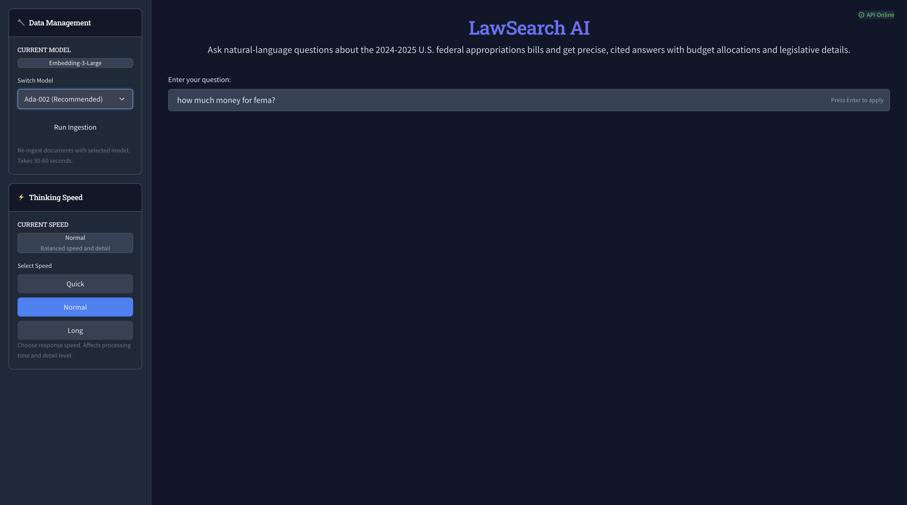

# LawSearch AI - Federal Appropriations Query System



A production-ready AI-powered system for querying federal appropriations bills using natural language. Built with **FastAPI**, **React**, and **OpenAI**, containerized with **Docker** for easy deployment.

## 🌟 Features

- **Natural Language Queries**: Ask questions about federal appropriations in plain English
- **Intelligent Routing**: Automatically searches across relevant appropriations divisions
- **Source Attribution**: Every answer includes citations from original legislative documents
- **Real-time Processing**: Fast RAG (Retrieval-Augmented Generation) pipeline
- **Production Ready**: Dockerized with health checks, CORS, and security headers
- **Modern Stack**: FastAPI backend + React TypeScript frontend

## 🏗️ Architecture

```
┌─────────────────┐    ┌──────────────────┐    ┌─────────────────────┐
│  React Frontend │    │   FastAPI Backend│    │   OpenAI + ChromaDB │
│   (Port 3000)   │◄──►│   (Port 8000)    │◄──►│   RAG Pipeline      │
└─────────────────┘    └──────────────────┘    └─────────────────────┘
```

### Tech Stack
- **Backend**: Python, FastAPI, Pydantic, LangChain, ChromaDB
- **Frontend**: React, TypeScript, Vite, Axios, React Query
- **AI**: OpenAI GPTs, LangGraph, text-embeddings
- **Infrastructure**: Docker and uv

## 🚀 Quick Start

### Prerequisites
- Docker and Docker Compose
- OpenAI API key ([Get one here](https://platform.openai.com/account/api-keys))

### 1. Clone and Setup
```bash
git clone <repository-url>
cd lawsearchprod
cp .env.example .env
```

### 2. Configure Environment
Create a `.env` file with your OpenAI API key:
```bash
OPENAI_API_KEY=sk-your-openai-api-key-here
```

### 3. Run with Docker
```bash
# Build and start all services
docker-compose up --build

# Or run in background
docker-compose up -d --build
```

### 4. Access the Application
- **Frontend**: http://localhost:3000
- **Backend API**: http://localhost:8000
- **API Documentation**: http://localhost:8000/docs

## 🛠️ Development Setup

### Environment Variables

#### Backend (.env)
**Required:**
```bash
OPENAI_API_KEY=sk-your-key-here
```
## 📖 API Documentation

### Endpoints

#### `POST /api/query`
Submit a query about federal appropriations.

**Request:**
```json
{
  "question": "How much funding did FEMA receive in 2024?",
  "max_results": 8,
  "include_sources": true,
  "divisions_filter": null
}
```

**Response:**
```json
{
  "answer": "Based on the 2024 Consolidated Appropriations Act...",
  "processing_time": 3.45,
  "selected_divisions": ["DEPARTMENT OF HOMELAND SECURITY"],
  "sources": [...],
  "timestamp": "2024-03-15T14:30:00Z",
  "query_id": "query_20240315_143000_abc123"
}
```

#### `POST /api/ingest`
Re-ingest data with a different embedding model.

**Request:**
```json
{
  "embedding_model": "text-embedding-3-small",
  "clear_existing": true
}
```

**Response:**
```json
{
  "status": "completed",
  "message": "Successfully ingested 14 divisions using text-embedding-3-small",
  "embedding_model": "text-embedding-3-small",
  "divisions_processed": 14,
  "processing_time": 45.2
}
```

#### `GET /api/health`
Health check endpoint.

#### `GET /api/status`
Detailed status information.

### Interactive Documentation
- **Swagger UI**: http://localhost:8000/docs
- **ReDoc**: http://localhost:8000/redoc

## 🗂️ Project Structure

```
lawsearchprod/
├── app/                      # FastAPI backend
│   ├── api/endpoints/        # API route handlers
│   │   └── query.py          # Query and ingestion endpoints
│   ├── core/                 # Configuration and utilities
│   │   └── config.py         # Pydantic settings
│   ├── models/               # Pydantic data models
│   │   └── query.py          # Request/response models
│   ├── services/             # Business logic
│   │   └── rag_service.py    # LangGraph RAG pipeline
│   └── main.py               # FastAPI application
├── frontend/                 # React TypeScript frontend
│   ├── src/
│   │   ├── components/       # React components
│   │   │   ├── IngestionSelector.tsx
│   │   │   ├── QueryForm.tsx
│   │   │   └── QueryResults.tsx
│   │   ├── hooks/           # React Query hooks
│   │   │   └── useApi.ts
│   │   ├── services/         # API client
│   │   │   └── api.ts
│   │   ├── types/           # TypeScript interfaces
│   │   │   └── api.ts
│   │   └── utils/
│   │       └── config.ts
│   ├── dist/                 # Built frontend (Docker)
│   ├── package.json
│   └── vite.config.ts
├── data/bills/              # Appropriations bill documents
├── db/chroma/               # ChromaDB vector storage
├── docker-compose.yml       # Production Docker setup
├── docker-compose.dev.yml   # Development Docker setup
├── Dockerfile.backend       # Backend Docker image
├── Dockerfile.frontend      # Frontend Docker image
├── requirements.txt         # Python dependencies
├── package.json             # Root npm scripts
├── DOCKER_GUIDE.md          # Detailed Docker operations guide
└── README.md               # This file
```

## Data Sources

The system queries **14 divisions** across two 2024 appropriations bills:

### Consolidated Appropriations Act, 2024
- **Division A**: Military Construction, Veterans Affairs, and Related Agencies
- **Division B**: Agriculture, Rural Development, Food and Drug Administration, and Related Agencies
- **Division C**: Commerce, Justice, Science, and Related Agencies
- **Division D**: Energy and Water Development and Related Agencies
- **Division E**: Department of the Interior, Environment, and Related Agencies
- **Division F**: Transportation, Housing and Urban Development, and Related Agencies
- **Division G**: Other Matters

### Further Consolidated Appropriations Act, 2024
- **Division A**: Department of Defense
- **Division B**: Financial Services and General Government
- **Division C**: Department of Homeland Security
- **Division D**: Departments of Labor, Health and Human Services, and Education, and Related Agencies
- **Division E**: Legislative Branch
- **Division F**: Department of State, Foreign Operations, and Related Programs
- **Division G**: Other Matters

## Testing the System

### Sample Queries
Try these example questions:
- "How much funding was allocated to NASA in 2024?"
- "What cybersecurity initiatives received funding?"
- "How much did FEMA receive for disaster relief?"
- "What transportation projects were funded?"

## 📝 License

MIT License - see LICENSE file for details.

---