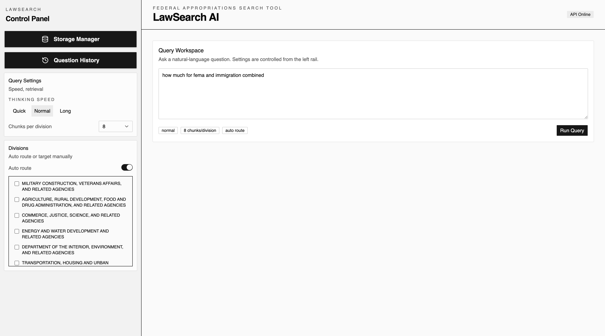
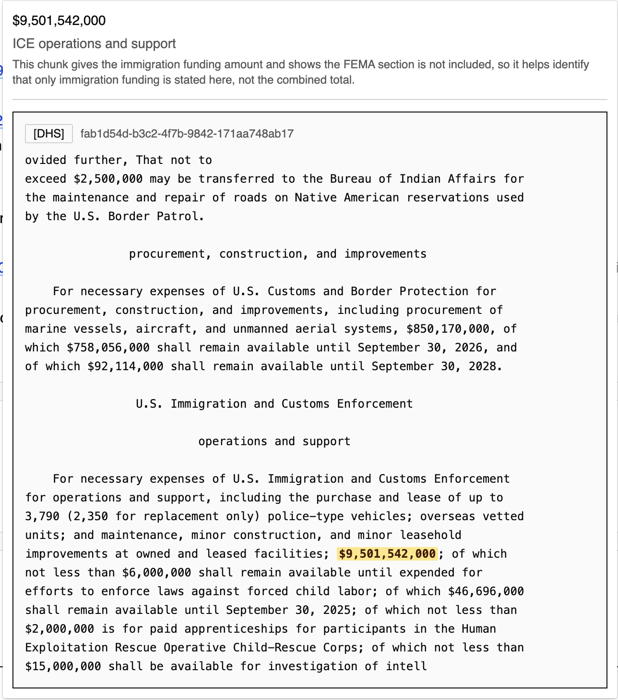
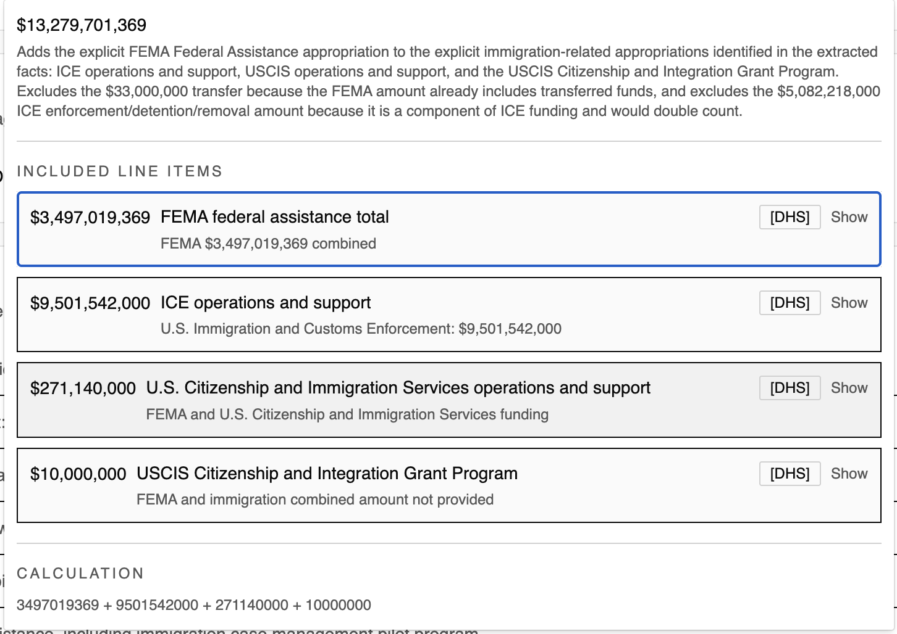
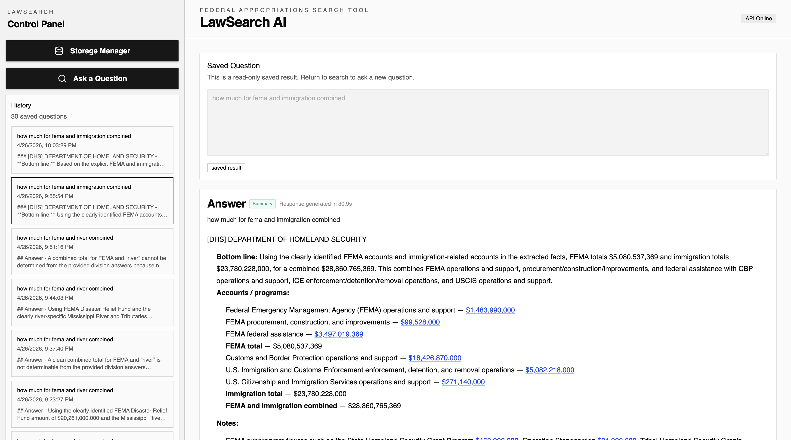

# LawSearch AI

LawSearch AI is a RAG application for querying FY2026 U.S. federal appropriations bills in plain English. It routes questions across the supported FY2026 appropriations divisions, retrieves relevant legislative text from ChromaDB, and uses OpenAI models to produce cited answers with source-backed dollar figures.

The project is built as a service-oriented FastAPI backend with a shadcn React/TypeScript frontend. It is designed to show a practical, inspectable AI system rather than a toy chatbot: ingestion, retrieval, model routing, source display, saved history, and storage management are all first-class parts of the app.



## Key Features

- Natural-language search across federal appropriations laws.
- LangGraph map-reduce pipeline with division routing, parallel chunk analysis, division-level reduction, and final synthesis.
- Configurable thinking speed, `max_results`, division filters, and source inclusion.
- Source-aware UI that highlights dollar figures and shows matching retrieved chunks with generated summaries.
- Storage manager for versioned Chroma vector stores, embedding model selection, and chunk size.
- Saved question history backed by PostgreSQL metadata and Chroma `chunk_id` hydration.
- Dockerized FastAPI + React stack with health and status endpoints.

## Source Backing

The source-backed popovers keep the retrieved chunk visible next to the highlighted dollar figure, so you can verify exactly which text supports a number.

<table>
  <tr>
    <td valign="top" width="58%">
      <p>
        The app highlights source-backed figures directly in the answer. Clicking the number opens the underlying chunk context and keeps the supporting text close to the claim.
      </p>
    </td>
    <td valign="top" width="42%">
      
    </td>
  </tr>
</table>

## Synthesized Results

The synthesis view brings the extracted facts together into a single answer, then breaks out the line items that contributed to the combined total.

<table>
  <tr>
    <td valign="top" width="58%">
      <p>
        The synthesis step combines the relevant line items, explains the calculation, and shows the total alongside the inputs that produced it.
      </p>
    </td>
    <td valign="top" width="42%">
      
    </td>
  </tr>
</table>

## Saved History

Saved questions preserve the original prompt and the generated answer, so you can return to prior searches without re-running the query.

<table>
  <tr>
    <td valign="top" width="58%">
      <p>
        History entries keep the original result visible in a read-only view, which makes it easy to scan prior questions and jump back into a previous answer.
      </p>
    </td>
    <td valign="top" width="42%">
      
    </td>
  </tr>
</table>

## Stack

- Backend: FastAPI, Pydantic, LangGraph, LangChain, ChromaDB, PostgreSQL, OpenAI
- Frontend: React, TypeScript, Vite, React Query, shadcn/ui, Tailwind
- Infrastructure: Docker Compose, persisted local vector stores and PostgreSQL metadata

## Quick Start

```bash
cp .env.example .env
# add OPENAI_API_KEY to .env
docker compose up --build
```

Set `LAWSEARCH_MODEL_PROFILE=deepseek` and `DEEPSEEK_API_KEY` in `.env` to compare the DeepSeek V4 Flash/Pro chat profile. OpenAI remains the default.

- Frontend: http://localhost:3000
- Backend: http://localhost:8000
- API docs: http://localhost:8000/docs

## Documentation

- [Setup guide](docs/SETUP.md)
- [Architecture notes](docs/ARCHITECTURE.md)
- [Docker operations](docs/DOCKER_GUIDE.md)
- [Railway deployment](docs/RAILWAY_DEPLOYMENT.md)

## Example Questions

- How much funding did FEMA receive?
- What cybersecurity initiatives received funding?
- How much was allocated to NASA?
- What transportation and housing programs were funded?

## Repository Layout

- `app/`: FastAPI backend, API models, services, and LangGraph RAG pipeline
- `frontend/`: React UI and API client
- `data/bills/`: source appropriations bill documents
- `db/chroma/`: local Chroma vector database
- `docs/`: setup, architecture, Docker notes, and images

## License

MIT
