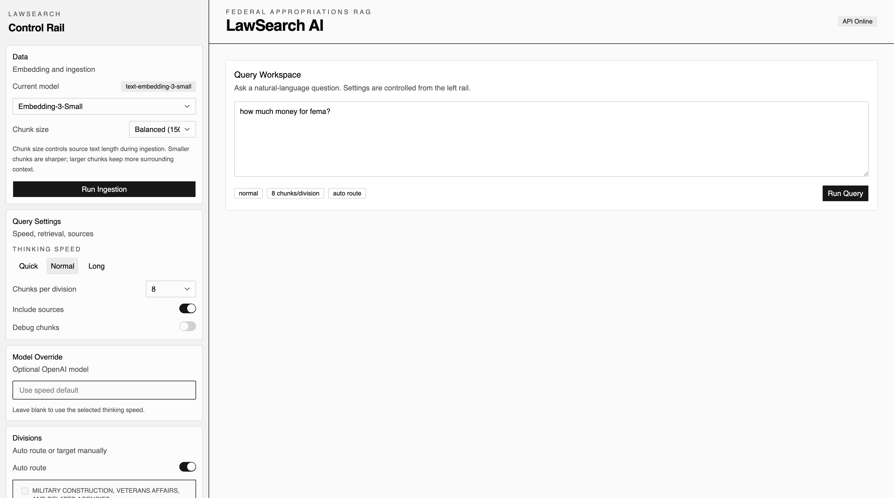

# LawSearch AI



LawSearch AI is a RAG application for querying U.S. federal appropriations bills in plain English. It routes questions across 14 appropriations divisions, retrieves relevant legislative text from ChromaDB, and uses OpenAI models to produce cited answers with source-backed dollar figures.

The project is built as a service-oriented FastAPI backend with a shadcn React/TypeScript frontend. It is designed to show a practical, inspectable AI system rather than a toy chatbot: ingestion, retrieval, model routing, source display, and debugging are all first-class parts of the app.

## Key Features

- Natural-language search across federal appropriations laws.
- LangGraph map-reduce pipeline with division routing, parallel chunk analysis, division-level reduction, and final synthesis.
- Configurable thinking speed, model override, `max_results`, division filters, source inclusion, and debug chunks.
- Source-aware UI that highlights dollar figures and shows matching retrieved chunks with generated summaries.
- Runtime ingestion controls for embedding model and chunk size.
- Dockerized FastAPI + React stack with health and status endpoints.

## Stack

- Backend: FastAPI, Pydantic, LangGraph, LangChain, ChromaDB, OpenAI
- Frontend: React, TypeScript, Vite, React Query, shadcn/ui, Tailwind
- Infrastructure: Docker Compose, persisted local vector store

## Quick Start

```bash
cp .env.example .env
# add OPENAI_API_KEY to .env
docker compose up --build
```

- Frontend: http://localhost:3000
- Backend: http://localhost:8000
- API docs: http://localhost:8000/docs

## Documentation

- [Setup guide](docs/SETUP.md)
- [Architecture notes](docs/ARCHITECTURE.md)
- [Docker operations](docs/DOCKER_GUIDE.md)

## Example Questions

- How much funding did FEMA receive?
- What cybersecurity initiatives received funding?
- How much was allocated to NASA?
- What transportation and housing programs were funded?

## Repository Layout

- `app/`: FastAPI backend, API models, services, and LangGraph RAG pipeline
- `frontend/`: React UI and API client
- `data/bills/`: source appropriations bill documents
- `db/chroma/`: local Chroma vector database
- `docs/`: setup, architecture, Docker notes, and images

## License

MIT