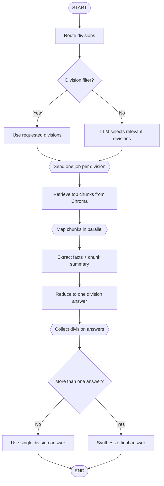

# Architecture Notes

LawSearch AI is a service-oriented RAG app for querying 2024 federal appropriations bills. The backend owns ingestion, retrieval, model selection, and answer generation. The frontend owns controls, query submission, and source display.

## System Shape

```text
React UI -> FastAPI API -> RAG services -> ChromaDB + OpenAI
```

Core backend modules:

- `app/main.py`: FastAPI app setup, CORS, logging, route registration.
- `app/api/endpoints/query.py`: query, ingest, health, and status endpoints.
- `app/models/query.py`: typed API contracts for requests, answers, chunks, and division results.
- `app/services/rag_service.py`: LangGraph workflow and query orchestration.
- `app/services/vector_store_service.py`: Chroma access and embedding model lifecycle.
- `app/services/ingestion_service.py`: bill parsing, division extraction, chunking, and vector rebuilds.
- `app/services/llm_factory.py`: OpenAI model strategy by task and thinking speed.

## Query Flow

1. API receives a question plus controls like `max_results`, `divisions_filter`, `include_sources`, `debug_chunks`, `thinking_speed`, and optional model override.
2. Router selects relevant appropriations divisions unless the user provides a filter.
3. Retriever pulls matching chunks from each selected division collection in Chroma.
4. Map step runs per chunk, extracting facts and generating a short chunk summary for the UI.
5. Reduce step combines mapped facts into one answer per division.
6. Synthesize step combines division answers only when more than one division answered.
7. API returns the final answer, selected divisions, division reductions, sources, debug chunks, model label, timing, and query ID.

## LangGraph Flow



## State Model

LangGraph state is kept flat and reducer-friendly. Retrieved chunks, mapped chunks, and division answers carry their `division` and acronym metadata with them instead of being nested in dicts by division. This makes fan-out/fan-in behavior explicit and keeps API objects typed.

## Frontend Behavior

The frontend uses a left control rail and right answer workspace. Users can select thinking speed, max results, divisions, source/debug display, embedding model, and ingestion chunk size.

Answers render as markdown. Literal dollar figures are highlighted when they match retrieved source snippets. Hovering a figure shows all matching chunks with the original text and generated chunk summaries.

## Operational Notes

- `DEBUG=true` enables concise `RAG_DEBUG` stage logs.
- Chroma data persists in `db/chroma/`.
- Re-ingestion clears stale Chroma clients and writes the active embedding model to `.embedding_model`.
- Single-division queries skip final synthesis to avoid extra latency.
